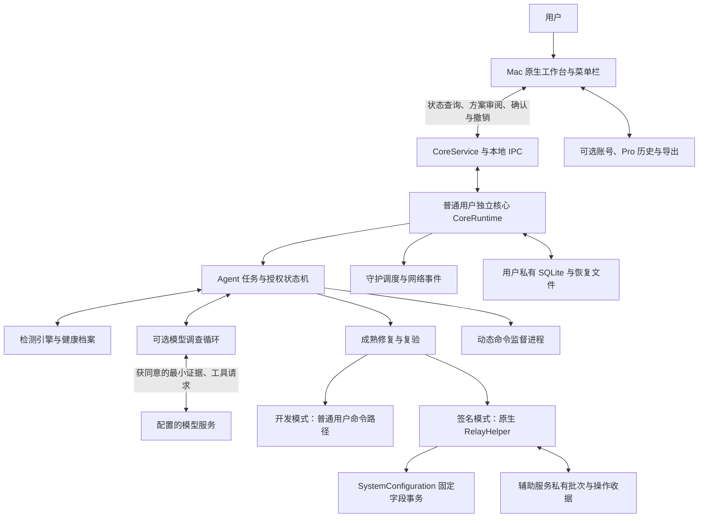
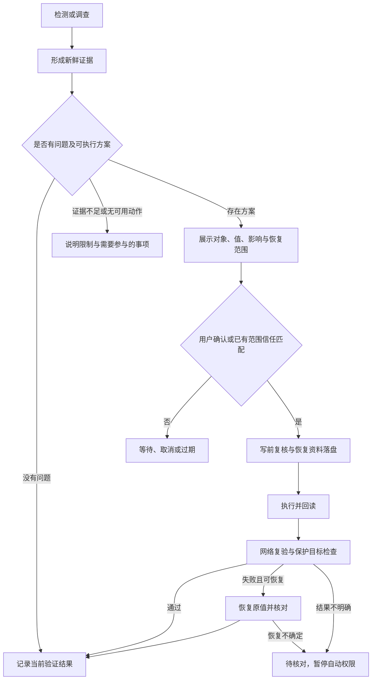

# NetCare Mac Agent：当前产品与实现全景

日期：2026-09-27。用途：阶段性产品 review，不是新的开发计划或完整产品验收声明。

命名补记：用户随后确认 NetCare，并要求统一页面与功能名称。本文产品名称已同步；下面的 597/614 项结果和 Relay 包差异是更名前的历史快照，不代表最新构建元数据。新包与更名验证见 [命名说明](BRAND-001-netcare.md)，不改变既有未完成项。

整体蓝图目标已按用户要求暂停。本次只整理现有实现、交互、技术边界及验收建议，不恢复自动开发。Windows 后续可选。

## 1. 先看结论

NetCare 当前是一个以本地核心为主的 Mac 网络保障开发版：已有五页原生工作台、健康档案、检测、守护、模型调查、授权方案、执行、复验和记录。核心流程在受控环境中贯通，但真实模型效果、真实管理员服务安装与网络修复尚未验收。

它不是“模型直接控制电脑”，也不是只有固定规则的检测器。当前职责划分为：

- 本地检测器提供证据；网络档案定义什么才算符合预期。
- 本地 Agent 组织任务、权限、执行与验证，是任务状态的权威来源。
- 可选模型提出假设、选择追加检查、提出成熟修复或动态命令方案，不能自行授予权限。
- 成熟修复引擎处理已知配置字段；动态命令走另一条明确风险、单独确认的通道。
- UI 呈现状态并收集用户决定，不把点击或模型结论直接当作执行成功。

**最欠缺的不是又一层架构，而是用户是否理解这个产品，以及一条真实网络场景是否确实产生价值的证据。**

### 本文的状态口径

| 标记 | 含义 |
| --- | --- |
| 可审阅 | 已有实现及原生界面，可评审操作与内容；不代表实网质量达标 |
| 受控闭环 | 模拟网络、临时作业或匿名原生 IPC 测试贯通；不能替代真实环境验收 |
| 接入待验 | 代码与入口存在，真实系统服务、凭据或外部供应商链路未验收 |
| 待完成 | 还没有完整实现或必要证据 |

### 更名前的验证基线

- 已有包：`dist/macos/Relay-3.0.0-arm64-local.zip`，arm64、本地 ad-hoc 签名、未公证。对应此前 597 项回归：594 通过、3 项 Windows 原生跳过。
- 暂停前最新源码回归：614 项，610 通过、1 失败、3 跳过。失败为 `test_accepted_begin_with_lost_reply_stays_pending_until_explicit_review`，预期 `not_started`，实际仍为 `rollback_failed`；本次不修复、不重跑。
- 更名前对照当时构建元数据，有 5 个构建输入与旧包不同：`mac_helper.py`、`mutations.py`、`RelayHelperService.m`、`RelayMutation.h`、`RelayMutation.m`。主要是断线恢复与未受理证明修改，当时未重新打包。
- 先前匿名 XPC 初始回复偶发超时仍未稳定定位；后续通过不能视为根因已消除。
- 下文功能说明保留审阅时的验证边界。新增未受理证明仍属在途；后续 NetCare 更名包虽包含当前源码，也不意味着该恢复场景已经验收。

## 2. 系统架构

### 2.1 运行结构

图中开发模式与签名模式是互斥路由，不是同时执行两次修复。动态命令不走 RelayHelper，也没有获得其高权限。

| 层 | 技术与职责 | 生命周期与限制 |
| --- | --- | --- |
| 桌面 | Python、PyObjC/AppKit 原生控件，rumps 菜单栏；五页工作台、确认窗口、报告 | 独立桌面进程；关闭窗口或退出桌面不等于停止核心；不是 Web/Tauri 壳 |
| 通信 | 严格 JSON 参数、实例绑定、请求去重、操作状态查询 | 开发版用同用户私有 Unix socket；签名模式实现双向身份核验 XPC |
| 普通核心 | Python `CoreRuntime`、`CoreService`，整合检测、档案、Agent、守护、调查、信任、记录 | 独立进程；默认用户权限；串行协调修改，取消不强杀尚在验证/回退的操作 |
| 模型适配 | `ResponsesModel` 与受限工具循环、传输子进程、预算及同意校验 | 可选；本次会话密钥，不自动继承上传同意；尚无真实模型质量证据 |
| 成熟执行 | `FixEngine`，写前复核、原值快照、执行、回读、网络复验、必要回退 | 源码/ad-hoc 保留普通用户命令路径，无自动提权；不能等同签名版 helper 路径 |
| 系统辅助 | Objective-C `RelayHelper`、NSXPC、Security、SystemConfiguration | 配对签名模式使用；设计为独立系统服务，仅 DNS/IPv6/代理开关；未完成真实 root 部署验收 |
| 动态执行 | `DynamicCommands` 与监督子进程，完整 argv/stdin、时限、输出额度、终态文件 | 当前用户权限；不是沙箱；不能保证通用副作用回滚，未知效果需人工核对 |
| 持久化 | 用户私有 SQLite、配置与恢复 JSON；helper 独立私有日志 | 数据可保留不等于权限恢复；未结清记录不能被普通清理隐藏 |
| 商业兼容 | 既有账号、Pro 历史、比较、导出 | 与 Agent 免费任务记录分离；账号不授予网络修改、守护或模型上传权限 |

### 2.2 两种运行模式，不能混为一谈

**现有源码/ad-hoc 开发包：** 桌面与普通核心通过私有本地 socket 通信。成熟修复未接生产 helper 时沿用普通用户 `networksetup` 路径，是否能写入取决于系统实际权限；没有偷偷提权。包中虽有 helper 文件，但不代表安装或启用了 root 服务。

**已实现的签名发行路径，尚待发行环境验收：** Developer ID 身份、固定应用标识、同团队、精确代码哈希、用户/会话等参与核验。普通核心通过用户 LaunchAgent 管理；系统 helper 单独申请管理员批准。签名模式的 helper 不可用时不会静默降级为普通写入。相关服务要求 macOS 13+；构建的 macOS 12 最低字段不代表这些能力可在 12 上使用。

**现在仍缺：** 正式签名与公证、真实系统批准/拒绝/注销、跨版本可信迁移、第二台 Mac 和真实网络修复验收。

### 2.3 核心领域对象

| 对象 | 产品含义 | 不能混淆为 |
| --- | --- | --- |
| HealthProfile / 目标 | 哪些资源应可访问、走何种路径、何时适用、如何判成功 | 当前网络快照、碰巧访问成功的网站 |
| Environment / Observation | 当前接口、VPN、DNS、代理、路由及目标的观测 | 企业可信配置或修改许可 |
| AgentRun | 一次检测/调查/处理任务，含事件、证据、假设、预算、方案与结果 | 一段无状态模型聊天 |
| ActionProposal | 对象、原值、目标值、影响、恢复范围和有效期明确的方案 | 模型的一句建议 |
| AuthorizationGrant / Trust | 本次具体动作或已审阅的有限范围执行许可 | 管理员权限、模型上传同意 |
| Receipt / Reconciliation | 实际执行历史、复验与后续核对 | 命令退出码、模型自行宣告恢复 |

## 3. 功能、交互与技术对应

### F01 总览与只读检测

- 用户需求：我需要的网络服务现在能否正常使用？依据是什么？
- 当前交互：总览显示保护目标、预期路径、最近检测、守护及任务状态；下方展开技术检查；顶部检测、调查、停止入口。
- 产品规则：正常、退化、未知、过期、不适用、需认证分开；未覆盖或旧证据不能视为当前正常。检测本身不授予写权限。
- 技术：`overview.py` / `overview_page.py` 投影；`DetectionEngine` 顺序运行 Wi-Fi、VPN、代理、DNS、IPv6、系统代理、可达性检查；档案评估补充目标语义。
- 状态：可审阅。复杂多接口、企业归属、真实 VPN 路径和厂商兼容仍有边界；不能承诺任意网络都能准确识别。

### F02 网络健康档案

- 用户需求：定义“对我有用的正常网络”，而不是默认所有网站都该连通。
- 当前交互：建立、复制、编辑、切换、移除档案；维护目标；导入先形成草稿，确认后保存；可导出。
- 产品规则：目标有 HTTP(S) 地址、访问路径、VPN 适用条件、成功标准；预期与观测分开；保存不修改系统配置，不把坏网络学成正常基线。档案修订使旧验证与旧授权不再直接适用。
- 技术：`HealthProfiles` / `ProfileConfig`、SQLite 版本与基线表、目标探测和路径核对。
- 状态：可审阅。企业可信分发、管理策略编辑、复杂环境身份与跨轮覆盖待完成。

### F03 主动守护

- 用户需求：启用后不必每次手动描述问题，由系统主动发现。
- 当前交互：总览守护开关；正常低打扰；新待确认/待核对任务进入记录，通知另有独立偏好；停止任务与暂停守护有明确入口。
- 产品规则：首次默认不启用；开启守护不同时授予修复权限。网络变化稳定后检查，有防抖、冷却、退避、探测预算和事件去重；范围内可用信任才自动执行，否则等待确认。
- 技术：`GuardService`、`ProbeBudget`、`MacNetworkEvents`、持久检查额度、Core 回调；事件订阅失败保留定时降级。
- 状态：受控闭环。真实切网、唤醒、长期运行和耗电尚未系统验收。

### F04 Agent 调查与模型推理

- 用户需求：不仅列异常，还能解释可能原因、选择下一步检查并根据实际结果调整。
- 当前交互：点击“调查问题”；模型设置及上传同意在权限与隐私页；记录内显示假设、证据、工具步骤、结论和停止原因。它不是以自由聊天输入框为中心的产品。
- 产品规则：模型可记录/修订假设、刷新环境、复查既有目标、提出成熟修复、提出动态命令或结束；工具请求由本地校验。模型不能自授权、扩展目标地址或以文字清除待核对状态。
- 技术：`ReasoningSession`、严格工具 JSON schema、证据编号、`ResponsesModel`、最小化上传与调用预算。授权执行后可在同一核心中继续同一调查，不重置预算。
- 状态：受控闭环。没有真实模型诊断质量或相对规则基线收益的证明；核心重启不自动恢复调查上下文。模型不可用时保留本地检测和已有成熟方案。

### F05 成熟修复方案

- 用户需求：对已知问题给出具体、可审阅、可验证的修改。
- 当前交互：进入待确认方案，查看对象、原值、目标值、影响和恢复说明，勾选并确认或取消；处理过程显示真实阶段。
- 当前动作范围：确认公司 VPN 与路径归属后恢复已保存公司 DNS；确认 VPN 已离开后恢复日常 DNS 或自动 DNS；仅在用户预期明确为关闭时关闭 IPv6；关闭已失联本机代理的 HTTP/HTTPS/SOCKS 开关。
- 产品规则：不是“网络不好就换公共 DNS / 关 IPv6 / 关代理”。需要准确环境、明确预期及对应问题证据；写前再次比较现场。
- 技术：`FixEngine._planned_actions`、Agent 方案哈希与一次授权、`MacMutationWriter`、原生固定字段事务。
- 状态：受控闭环；真实系统权限与网络效果待验，不是通用路由器/VPN/账号修复器。

### F06 动态命令

- 用户需求：固定动作覆盖不了时，允许提出新的处理步骤。
- 当前交互：完整命令参数与标准输入可审阅，必须单独确认当前用户权限风险；记录保留执行结果，未知副作用走人工核对。
- 产品规则：命令自称只读不算安全证明；退出码 0 不等于网络恢复；不能自动执行任意回滚文本；现有成熟修复信任不覆盖动态命令。
- 技术：`dynamic.py` 绑定内容/现场/身份/可执行文件哈希；`jobs.py` 监督进程、超时/取消、输出限额、独立终态文件；与成熟任务共享同用户执行锁。
- 状态：受控临时作业通过；不是网络沙箱。完整副作用模型、通用补偿以及与 helper 统一设备级协调尚未完成。建议本次 MVP 验收不把它设为必经路径。

### F07 授权与范围信任

- 用户需求：默认可控，明确理解后减少重复确认，并能随时撤销。
- 当前交互：默认逐次确认；符合条件的成熟方案可选本次任务或持续范围信任；权限页单独撤销。范围页仍展示较多技术细节。
- 当前参数：具体方案约 5 分钟有效且一次使用；任务信任 15 分钟/最多 3 批；持续信任仅当前核心 8 小时/最多 12 批。这些是实现默认值，不是已经通过用户研究验证的最佳参数。
- 产品规则：绑定字段、目标值、准确服务、档案、网络/VPN 环境；过期、额度耗尽、撤销、超范围或验证异常停止自动执行。核心重启保留审计，不复活可执行信任。
- 技术：`AuthorizationGrant`、`RepairTrust`、持久额度预留、每次写入前重新核验。
- 状态：受控闭环；跨核心持续信任不支持。系统管理员批准、模型上传同意和守护启用都是另外的决定。

### F08 复验、回退与中断恢复

- 用户需求：知道到底有没有修好；失败时不要留下不明修改。
- 当前交互：处理阶段显示复验/回退；待核对记录可打开私有收据，看原值、现值、服务身份，再明确选择恢复原值或保留修改并复验。
- 产品规则：字段回读成功不等于网络恢复；原问题应解除且保护目标不退化。第三方新值不覆盖；无法确认就保留待核对。配置已恢复和网络已健康是不同结果。
- 技术：普通核心恢复快照、helper prepared/终态日志、持久批次、精确操作 ID、重新审阅令牌、只读核对和受限反向事务。
- 状态：主体为受控闭环；真实 root/跨登录会话待验。“begin 未受理证明”和本地上下文释放修改在初次 review 时尚未进包，源码新增一项断线场景测试失败。后续更名包包含这些在途代码，但未修复该失败，不把该补强标为已验收。

### F09 处理记录、证据与报告

- 用户需求：知道做过什么、为什么、结果如何，必要时交给支持人员。
- 当前交互：最近任务搜索、全部待核对入口；详情按时间线、调查依据、修改回读组织；基础脱敏报告与私有执行收据分开。
- 产品规则：假设不冒充根因；原执行历史不因后来核对成功而改写；未知副作用的人工确认结果不冒充自动验证。免费 Agent 记录不要求商业账号。
- 技术：`AgentStore`、`agent_records.py`、`task_details.py`、白名单脱敏投影、独立恢复文件。
- 状态：可审阅。已有保留设置及未核对保护，但 root 恢复资料的安全清理尚未完成。

### F10 权限与隐私

- 用户需求：知道哪些信息会离开电脑，以及现在允许系统做什么。
- 当前交互：设置模型名称/地址/本次密钥；独立审阅上传同意、停止上传/忘记密钥；查看与撤销修复信任。
- 产品规则：保存模型地址不代表同意上传；原始配置、完整命令与输出不作为普通模型证据上传；重启不恢复密钥/上传同意。切换地址不能沿用旧密钥授权。
- 技术：`ModelConsent`、修订绑定、最小证据 schema、隐私审计、本次核心内存凭据、传输限额与取消。
- 状态：可审阅、协议受控测试通过；真实供应商数据处理与模型安全凭据库尚未验收/完成。

### F11 设置、启动与退出

- 用户需求：软件什么时候运行、怎么停止、如何移除，不能关了窗口却误以为后台已停。
- 当前交互：检测预设、重新识别、通知、保留策略；核心启动/停止；登录启动、系统配置修复批准/核对、准备移除。后几项受构建身份和系统支持条件限制。
- 产品规则：退出桌面不停止核心；明确停止后普通重开不擅自启动。停机先撤销新动作、等验证/回退、释放所有权，再确认；卸载准备不删除应用和资料。
- 技术：`CoreLifecycle` 所在 `lifecycle.py`、`mac_service.py`、用户 LaunchAgent、独立 LaunchDaemon、停机回执。
- 状态：冻结包空闲启动/重连/停机已验证；真实系统注册、批准、拒绝、注销和安装升级待验。

### F12 既有账号与 Pro 功能

- 用户需求：新工作台不丢失既有账号、历史比较和报告功能。
- 当前交互：设置页登录/退出/同步，菜单或记录入口查看历史、比较、导出。
- 产品规则：本地 Agent 基础能力与商业权益分离；Pro 诊断快照不等于完整 Agent 审计；账号不会扩大网络或模型权限。
- 技术：`DesktopServices` 复用既有 commercial 模块、历史 SQLite 与 Keychain 协议。
- 状态：兼容代码及离线/模拟 UI 验证通过；真实账号/官网往返未在这轮 Agent 实施中验收。

## 4. 关键用户流程

### 4.1 第一次打开

当前直接进入五页工作台，而不是一个完整的新手向导。桌面连接或按规则启动独立核心，显示已有/初始目标；未知明确显示未检测。用户可先只读检测，再调整档案。守护、上传、修复信任、系统服务批准分别管理。

缺口：如何引导普通用户选目标、理解访问路径、区分检测与调查、完成首次成功体验，还没有一个经过用户验收的连续流程。

### 4.2 手动处理一项问题

图中的“记录结果”包含 verified、已回退/恢复等不同结果，不把回退成功画成网络修复成功。模型调查在权限、时间和预算仍允许时可依据收据继续同一任务；不是无限重试。

### 4.3 自动守护

用户启用 → 网络事件或预算内定时检查 → 等待稳定 → 判断目标与异常 → 本地/模型调查 → 有匹配信任则执行，否则等待参与 → 验证与记录 → 继续守护或保留待核对。

“自动”当前指有界调度和获准范围内执行，不代表安装即常驻，也不代表所有故障都能自主处理。

### 4.4 中断后回来

重连 UI → 读取原任务和记录 → 不盲目重放写入 → 只读核对 → 能证明终态则更新核对结果，否则显示待参与 → 用户重新审阅恢复或保留 → 新鲜复验。

旧修复授权、模型同意、密钥不会因重连/重启凭空恢复。动态命令副作用仍是单独人工核对路径。

## 5. 当前交互结构与截图

### 页面职责

| 页面 | 核心问题 | 主要操作 |
| --- | --- | --- |
| 总览 | 现在网络是否符合我的预期？正在做什么？ | 检测、调查、守护、停止、查看待确认方案 |
| 处理记录 | 刚才为什么做、做了什么、结果如何？ | 搜索、任务详情、报告、私有收据与恢复 |
| 网络档案 | 我期望哪些资源、路径和条件正常？ | 目标编辑、版本、切换、导入草稿与导出 |
| 权限与隐私 | 我允许了哪些动作和数据上传？ | 模型设置、上传审阅/撤销、范围信任撤销 |
| 设置 | 软件怎样运行，已有账号和历史怎么办？ | 检测预设、生命周期、通知、保留、账号 |

设计采用系统原生控件、固定侧栏、内容滚动、深浅色适配；默认窗口 1060×700、最小 760×560。切页不触发检测，尽量保留草稿和焦点；迟到响应不抢回页面。完整键盘/读屏/高对比验收还未完成。

以下是已存在的 Cocoa 测试截图，不是新做的设计稿，也不是当前宿主网络的实时状态。测试中的目标、地址、VPN 名称及结果为夹具数据。

#### 总览

#### 范围授权

其他可审阅截图：[网络档案](/Users/wangxinlei/Documents/ai-projects/20260914-network诊断/build/ui-preview/workspace-profiles-light.png)、[处理记录](/Users/wangxinlei/Documents/ai-projects/20260914-network诊断/build/ui-preview/workspace-records-light.png)、[恢复审阅](/Users/wangxinlei/Documents/ai-projects/20260914-network诊断/build/ui-preview/recovery-light.png)。

### 当前体验上的问题，不等同必须继续开发的清单

1. 首次打开缺少连续引导。用户需要先理解“保护目标、网络档案、守护、调查”等多个概念。
2. 检测与调查两个入口的差异对普通用户不够直观，模型未配置时“调查”能做到什么需要更清楚。
3. 授权页虽然完整，但技术负担明显：哈希、原始结构、接口和协议字段占据较大篇幅。应 review 用户是否真的能据此做决定。
4. 未检测目标使用警告色，同时显示 0/N 符合预期，可能被误读为 N 个目标都故障。这是从截图得出的体验判断，不是新发现的网络算法错误。
5. 后台核心、守护、登录启动、管理员修复服务、上传同意、修复信任分离有安全价值，但设置成本可能过高。
6. 当前工程证明多于效果证明：能追踪、能拒绝、能记录，不等于用户认为它诊断得准、修得好。

## 6. 数据与权限边界

默认普通核心目录为 `~/Library/Application Support/Relay`。其中 Agent SQLite 存任务、档案版本、验证基线、预算、IPC 去重和权限审计；配置及恢复材料分开保存。用户私有权限和执行锁约束访问与并发。

系统辅助服务设计使用 `/Library/Application Support/com.wangxinlei.relay/privileged`，持有独立的控制记录、批次终态和操作收据；此为实现中的部署路径，并不意味着本次已经在宿主机创建或启用了该服务。身份目前固定同一构建，可信跨版本迁移未完成。

五种决定必须区分：开启守护、同意模型上传、批准具体修复/范围信任、批准系统服务、登录商业账号。任何一种都不隐式替代其他决定。

## 7. 阶段验收建议，尚未自动执行

### 第一轮：现在就评产品

用现有开发包审阅总览、只读检测、档案、记录、权限说明。重点回答：是否知道现在发生了什么、下一步能做什么、为什么要授权，以及这些信息是否值得常驻一个应用。

不把真实高权限修复、动态命令或持续信任作为这一轮试用的前提。也不通过安装到日常电脑或改动日常网络来证明测试通过。

### 第二轮：只验一条真实闭环

在你确认产品方向后，再决定是否安排隔离 Mac/测试网络：选择一个已覆盖的 DNS 场景，明确目标和预期，走检测 → 方案 → 逐次确认 → 修改 → 复验 → 记录；失败须能解释，并按能力恢复或保留待核对。

当前没有预先承诺场景已实机通过，也不把真实模型效果验收悄悄删除。如果你认为“Agent 主动判断”是 MVP 的核心价值，就应同时选一项真实模型调查案例，对比本地规则结果，判断模型是否带来增益。

### 暂不设为阶段门槛

Windows、任意动态命令通用补偿、跨重启持续信任、可信自动升级、复杂 VPN 厂商矩阵、企业配置分发和经验包。保留实现与愿景，不以它们继续推迟当前产品 review。

**阶段退出由产品体验和选定场景决定，不再由测试数量或“把所有边界做完”决定。**

## 8. 源码与规格索引

以下对应实际模块，便于追查；历史 PRD/台账中的“下一步”是当时记录，不表示整体目标已恢复运行。

| 范围 | 主要源码 | 合同 |
| --- | --- | --- |
| 桌面与导航 | `remote_desktop.py`、`workspace_window.py`、`remote_controller.py` | SPEC-008 |
| 核心与 IPC | `core.py`、`core_service.py`、`ipc.py`、`mac_xpc.py` | SPEC-005、009 |
| 检测与档案 | `engine.py`、`checks/`、`profiles.py`、`target_paths.py` | SPEC-002 |
| 任务与调查 | `agent.py`、`reasoning.py`、`models.py`、`model_transport.py` | SPEC-003 |
| 守护与信任 | `guard.py`、`mac_events.py`、`trust.py` | SPEC-006、BLUEPRINT-001 |
| 动态作业 | `dynamic.py`、`jobs.py`、`private_files.py` | SPEC-004 |
| 原生事务与辅助 | `mutations.py`、`mac_helper.py`、`apps/macos/native/RelayMutation.m`、`RelayHelperService.m` | SPEC-010、011、012 |
| 生命周期 | `relay_app.py`、`lifecycle.py`、`mac_service.py` | SPEC-007、011 |
| 记录与隐私 | `agent_store.py`、`agent_records.py`、`task_details.py`、`preferences.py`、`management_window.py` | SPEC-005、006、008、012 |
| 商业兼容 | `desktop_services.py`、`commercial/` | SPEC-008 |

除注明 `apps/` 或入口文件者，上表模块位于 `code/relay/`。可直接打开：[核心装配](/Users/wangxinlei/Documents/ai-projects/20260914-network诊断/code/relay/core.py:68)、[任务模型](/Users/wangxinlei/Documents/ai-projects/20260914-network诊断/code/relay/agent.py:60)、[模型工具定义](/Users/wangxinlei/Documents/ai-projects/20260914-network诊断/code/relay/reasoning.py:58)、[成熟动作生成](/Users/wangxinlei/Documents/ai-projects/20260914-network诊断/code/relay/engine.py:209)、[桌面装配](/Users/wangxinlei/Documents/ai-projects/20260914-network诊断/code/relay/remote_desktop.py:10)。

原始依据：[产品目标](/Users/wangxinlei/Documents/ai-projects/20260914-network诊断/docs/product/prds/PRD-002-autonomous-network-agent.md)、[目标蓝图](/Users/wangxinlei/Documents/ai-projects/20260914-network诊断/docs/architecture/BLUEPRINT-001-autonomous-network-agent.md)、[实施台账](/Users/wangxinlei/Documents/ai-projects/20260914-network诊断/docs/engineering/tickets/TKT-002-autonomous-agent-delivery.md)、[历史 QA 证据](/Users/wangxinlei/Documents/ai-projects/20260914-network诊断/docs/quality/reports/QA-002-diagnostic-panel.md)。本文补记了暂停前的 614 项结果，不覆盖或改写历史通过记录。
