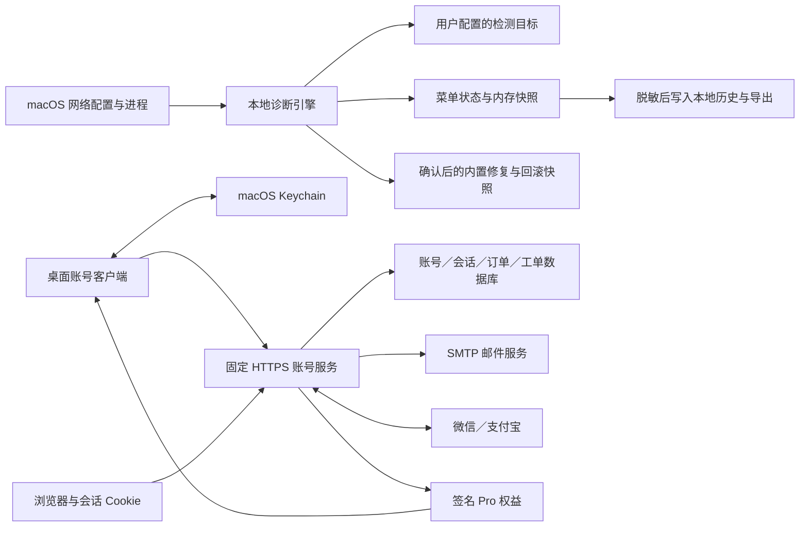

# SEC-001 数据流与威胁模型

版本 0.1，核查日期 2026-09-26；适用范围为本仓库 Relay 3.0 桌面源码、商业 API、官网与部署模板。本文记录当前实现及未完成条件，配合 [PRD-001](../product/prds/PRD-001-commercialization.md) 和 [SPEC-001](../architecture/specs/SPEC-001-commercialization.md) 使用。它不是合规认证、独立渗透测试结论或法律审查意见；公开发布前仍需确认服务主体、适用政策和实际运行环境。

## 1. 信任边界与数据流

- `DetectionEngine` 不导入账号或许可证模块。基础检测、状态查看、基础脱敏报告和确认后的安全修复不需要登录或联系账号服务器。账号配置、Keychain 或历史存储不可用时，基础检测仍可工作。
- 本地检测会读取接口、地址、路由、DNS、代理、已知进程及连通性结果。它会主动请求配置中的检测目标；目标站点、DNS 服务及实际代理可看到该次请求的必要网络信息。**“诊断结果不默认上传账号服务”不等于“诊断不产生出站流量”。**
- 当前没有诊断遥测上传端点，也没有把快照自动放入客服工单的调用。账号请求仅处理登录、会话和权益；工单正文是用户在网站主动提交的数据。
- 系统修复是独立的高权限影响边界：使用当前进程已有权限执行内置 `networksetup` 动作，不运行配置中的任意 shell 字符串，不自动提权。用户确认后仍需重新验证环境；不能确认或恢复时如实返回失败。

依据：[菜单与控制器](../../code/network-doctor-menu.py)、[诊断/修复引擎](../../code/relay/engine.py)、[命令边界](../../code/relay/commands.py)、[账号客户端](../../code/relay/commercial/client.py)、[服务端路由](../../backend/config/urls.py)。

## 2. 数据清单与存储位置

| 数据 | 当前保存位置与内容 | 保护与边界 |
|---|---|---|
| 当前诊断快照 | 桌面进程内存；可能包含真实 IP、SSID、VPN 路由、代理端点、检查错误 | 菜单状态是本机可见信息，不等同已脱敏文件；基础报告展示与导出另走脱敏函数 |
| 桌面检测配置 | `~/Library/Application Support/Relay/config.json`；预设、公司档案、检测目标等 | 不保存账号 token；可能包含企业地址或自定义目标，不能当作公开资料。首次升级可读取并复制 `~/.config/relay/config.json`，原文件保留 |
| 账号会话与签名缓存 | macOS Keychain，service 为 `com.relay.account.` 加账号服务 origin 的 SHA-256 前 16 位，account 为 `session` | 包含 access/refresh token、账号/会话标识、邮箱、license、权益及 `lastSeen`。明确使用 macOS 原生 keyring 后端，无明文文件回退 |
| 公开商业配置 | App `Contents/Resources/relay-commercial.json` | 仅固定 origin、公钥和开发标志；公钥不是秘密。已打包 App 不接受 `RELAY_COMMERCIAL_CONFIG` 环境变量替换；源码开发才允许此覆盖 |
| Pro 历史 | `~/Library/Application Support/Relay/history.sqlite3` | 仅写诊断 `status/issues/check_errors`，入库前脱敏，不保存账号外层对象；新文件以 `0600` 创建。数据库未使用应用层加密，不能抵抗同一用户或 root 读取 |
| 修复恢复快照 | `~/Library/Application Support/Relay/repair-snapshots/repair-*.json` | 保存本次涉及的旧值、目标、上下文和验证基线，**保留真实恢复数据，不执行报告脱敏**。目录必须由当前用户拥有且权限 `0700`；通过独占临时文件、`0600`、原子替换与同步写入持久化 |
| 桌面运行日志 | `~/Library/Application Support/Relay/Relay.log` | 当前只写启动与操作失败类别，不写完整快照、会话或 token；文件权限遵循创建时 umask，未实现轮转。旧版 `~/Library/Logs/Relay*.log` 不会由升级自动清除 |
| 用户导出文件 | 通过系统目录选择器指定的位置；Free 单次 JSON，Pro HTML/JSON 诊断包 | 新文件使用独占创建与 `0600`，导出前脱敏，HTML 转义动态内容；不自动发送或上传，用户自行控制副本 |
| 开发服务数据 | 默认 `backend/.runtime/`，可由绝对 `RELAY_RUNTIME_DIR` 覆盖 | SQLite、开发 Django secret、开发 Ed25519 私钥、公钥、开发邮件及静态构建文件。目录在 Git 忽略范围内，不能打入公开镜像或安装包 |
| 生产服务数据 | 代码目录外的 `RELAY_RUNTIME_DIR`、外部 PostgreSQL、独立秘密文件/环境 | 包括账号邮箱、条款确认、会话摘要、订单/退款/权益、工单、审计及版本记录。应用层未对全部业务列加密；磁盘/备份加密、访问控制由部署方配置 |
| 浏览器本地状态 | 登录/CSRF Cookie、`localStorage["relay-theme"]` | 登录 Cookie 为 HttpOnly、SameSite=Lax，生产 Secure；localStorage 仅存外观选择，不存桌面 token。当前页面无广告跟踪或第三方分析脚本 |

配置文件、运行日志及已经存在的目录不都经过强制权限收紧，不能把“部分新文件以 `0600` 创建”描述为整个数据目录已经加密或全部完成权限审计。仓库内旧项目资料、历史诊断报告也可能含真实网络样本；对外开放仓库前应独立检查，不能依靠新版报告脱敏覆盖历史资料。

依据：[配置读写](../../code/relay_config.py)、[Keychain 实现](../../code/relay/commercial/client.py)、[历史与导出](../../code/relay/commercial/history.py)、[修复持久化](../../code/relay/engine.py)、[服务端模型](../../backend/commerce/models.py)、[运行配置](../../backend/config/settings.py)、[主题存储](../../backend/static/theme.js)。

## 3. 登录、会话与离线权益

### 浏览器与桌面授权

邮箱验证码有效 10 分钟、一次消费、最多 5 次验证尝试；发送按邮箱分钟/小时和来源 IP 限流。数据库保存验证码的带服务器密钥 HMAC 摘要，邮件本身必然包含验证码。开发邮件后端写入本机 `mail/`，不代表真实发送，也不应视为普通可公开日志。公共验证码入口拒绝管理员账号登录。

普通邮箱会话使用独立的 `EmailCodeBackend`，每次恢复会话都要求账号仍为活跃且非 staff/superuser；管理员密码登录使用 `AdminPasswordBackend`。普通账号随后被提升为管理员，其已有邮箱会话不会继承后台权限，已有桌面 Bearer/refresh 凭证也被拒绝。旧版混合认证后端不再列入允许后端，使旧 Cookie 不能继续沿用该登录来源；管理员需通过独立密码入口重新登录。

桌面生成随机 PKCE verifier 与 state，仅发送 S256 challenge 发起请求。浏览器登录后通过 Cookie 与 CSRF 确认设备；确认页不返回桌面凭证。桌面携带 verifier/state 轮询，授权有效 5 分钟、最多 5 次错误证明、合法轮询至少间隔 3 秒；成功通过事务消费一次。URL 中的 request UUID 本身不能兑换 token，但仍属于不应无故传播的短期授权元数据。

access token 有效 1 小时，refresh token 有效 90 天并轮换；服务端保存其 HMAC 摘要。已使用 refresh token 的重放会撤销对应会话。浏览器请求由 Cookie/CSRF 保护；只有成功验证 Bearer 后才跳过对应 API 的 CSRF 检查，不能仅靠伪造 Authorization 头绕过。

菜单主线程只读缓存，不等待账号 HTTP 锁。恢复/刷新在后台运行，定期刷新间隔为 15 分钟；付费操作另在后台即时检查本地签名权益。登录取消、退出账号和迟到的成功轮询会按序协调。服务器不可达时，本地退出会清除会话并说明服务器撤销未确认；Keychain 清理失败会报错，不能宣称已彻底删除。用户可在线在账户页再次撤销会话。

### Pro 签名的信任根

- 固定 Ed25519 JWS header：`alg=EdDSA`、`typ=JWT`、`kid=license-v1`。
- 校验随 App 配置的公钥、固定发行者、`aud=relay`、账户 `sub`、会话 `sid`、签名、时间及允许的 feature 集合；拒绝重复 JSON claim、错误算法与其他账号/产品的签名。
- `exp` 不得晚于实际权益截止，也不得晚于签发后 `7 × 86400` 秒。公钥不从每次 API 响应替换；签名私钥只在服务端使用。
- `lastSeen` 在 Keychain 保存时间高水位。超过容差的回拨会拒绝权益，允许范围内也以 `max(now,lastSeen)` 判断，不能因小幅回拨恢复已经观察到的过期状态。
- 离线撤销无法即时传播：正常、未被篡改的客户端可能继续使用最后一次有效签名至 `exp`，最长不超过签发后的 7 天。服务端撤销会话或退款会阻止后续在线签发/续期，但不会远程删除已经在离线设备上的签名。
- 这不是防篡改硬件时钟或不可破解 DRM。控制本地用户账号、Keychain、应用代码或系统的恶意用户可以绕过客户端功能开关；不能据此声称付费功能不可破解。服务器仍独立验证在线身份、订单与权限。

依据：[服务端认证](../../backend/commerce/auth.py)、[登录来源隔离](../../backend/commerce/backends.py)、[认证中间件](../../backend/commerce/middleware.py)、[桌面签名验证](../../code/relay/commercial/license.py)。

## 4. 脱敏与日志边界

报告/历史脱敏覆盖已知敏感字段，递归处理键和值，隐藏 SSID/BSSID、邮箱、token/密码/API key、Authorization/Cookie 等认证头、IPv4/IPv6/MAC；HTTP(S) URL 去掉凭据、路径、查询与 fragment。HTML 导出使用转义，避免将诊断文字当作脚本。

这些规则不是内容分类器，也不能保证任意文本匿名化。域名、应用名称、错误说明、自定义字段及未知格式仍可能泄露组织或工作信息；未命中规则的秘密也可能保留。报告导出与原始配置、恢复快照是不同用途的数据，不能把后两者当成已脱敏报告发送。当前同一地址被隐藏后，地址级差异可能无法在 Pro 历史对比中还原，这是隐私与诊断粒度的明确取舍。

日志分层如下：

- 桌面菜单日志仅记录事件和异常类型；核心命令返回值保留在检查结果中，并不默认全量写日志。macOS 系统日志、崩溃报告和用户自行启动时的 stdout/stderr 不由该脱敏器统一控制。
- Django 关闭默认开发请求日志 `django.server`，应用不主动记录验证码、请求正文、支付原始响应或 token。这不是所有依赖、反向代理或异常采集平台的全局脱敏保证。
- Nginx 模板仅记录来源 IP、方法、`$uri`、状态码和字节数，省略查询串与正文；来源 IP 本身仍是需要管理的日志数据。
- Docker 模板的 Gunicorn 使用显式 access log 格式，只记录来源、方法、路径、状态码和字节数，省略 query/header/body。部署前仍须审阅代理、应用、异常采集平台的实际日志样本，不能只凭模板宣称整条请求链已完成脱敏。
- 客服工单正文由用户主动填写，当前按正文保存，不进行与桌面报告相同的自动脱敏。页面提示不要提交密码或验证码并不能替代访问控制、误提交处理及运营审核。

依据：[脱敏函数](../../code/relay/commercial/history.py)、[菜单日志](../../code/network-doctor-menu.py)、[Django 日志配置](../../backend/config/settings.py)、[Nginx 模板](../../deploy/commercial/nginx.conf)、[容器启动命令](../../deploy/commercial/Dockerfile)。

## 5. 支付与账本的信任边界

客户端套餐选择、浏览器返回页、按钮状态、用户截图以及普通登录权限都不是付款成功证据。服务端按套餐定价并核对用户确认的报价；订单、退款、工单与设备会话按所属账号访问。

微信通知先验证配置的支付公钥 ID、RSA 签名、时间戳（允许窗口 300 秒）与 nonce 格式，再用 API v3 密钥解密 AES-GCM 通知；随后核对 appid、mchid、渠道、订单、金额、币种、支付状态及交易编号。主动查询响应也验签。支付宝通知验证 RSA2、固定渠道公钥、appid/seller、订单及精确金额；主动查单验证响应签名。服务器只接受相应成功状态来发放权益。

回调端点不依赖 CSRF Cookie，而依赖上述提供方签名和业务核验。消息不是“验签通过就直接加天数”：发放在数据库事务内锁定账号/订单，订单 grant 一对一、账号幂等键及渠道流水号唯一约束共同防止重复发放；重放已处理成功通知不会再发一份权益。未核验的付款失败保持待核查，而非假成功。

用户只能申请退款；后台具备 `commerce.process_refund` 权限的运营者提交渠道退款。渠道确认后只撤销对应 grant，并重排未消费的后续权益，保留其他购买；处理动作有审计事件。审计记录位于同一业务数据库，当前不是外部不可篡改日志，拥有数据库权限的管理员仍能改变它。

真实商户密钥与支付开关默认未配置。模拟付款只在明确启用的 development 环境可用，模拟订单与真实渠道区分，生产配置拒绝该开关。现有验证不能替代真实商户接入、密钥轮换、重复通知、查单、退款与对账演练。

依据：[支付适配器](../../backend/commerce/payments.py)、[账本事务](../../backend/commerce/domain.py)、[模型约束](../../backend/commerce/models.py)、[管理员权限](../../backend/commerce/admin.py)。

## 6. 当前威胁与剩余边界

| 威胁/故障 | 已有控制 | 尚不能保证的部分 |
|---|---|---|
| 网络中间人、恶意跳转或替换 license | 生产 HTTPS、客户端固定 origin/公钥、不跟随账号 HTTP 重定向、签名绑定账号/会话 | 本地根证书、App 本体或配置被有权用户改写；服务端私钥泄漏后的存量离线签名处置 |
| 验证码猜测、授权链接泄漏、轮询重放 | 有效期、尝试上限、限流、PKCE/state、事务一次消费、刷新重放撤销 | 邮箱被接管、验证码钓鱼、用户批准并非自己发起的设备；当前没有额外终端硬件证明 |
| 越权查看他人订单/退款/工单、网页 CSRF/XSS | 对象归属检查、Cookie/CSRF、严格 Bearer 验证、前端转义、同源 CSP、敏感页 no-store | 实际代理/CDN/CSP部署错误、运营权限滥用、未知漏洞；管理员页不使用同一前台 CSP |
| 错误诊断导致断网或代理误关闭 | unknown 不视为健康；VPN 需路由/接口/归属证据；代理证据绑定待改服务；修复 allowlist、快照、前后验证、回滚 | OS 配置不是数据库事务，外部程序可能同时修改；回滚可能失败。遇到变化保留外部值并报告，不承诺永不短暂中断 |
| 任意 shell 执行 | 核心命令用 argv，忽略历史配置任意 shell 模板，修复动作固定 | 不能防御已有本地代码修改或同用户执行权限的恶意软件；检测目标也应来自可信配置 |
| 本机诊断信息泄露 | 报告/历史脱敏，独立凭证存储，敏感恢复快照权限检查 | 本地原始配置、恢复文件、历史资料、系统日志、备份及用户手工复制的内容并未全部匿名化或加密 |
| 后台/密钥泄漏造成越权、伪造权益 | 管理员与公共 OTP 登录隔离、独立退款权限、私钥不返回 API、生产拒绝不完整配置 | 当前没有内建管理员 MFA、外部不可篡改审计或 HSM；这些运营控制尚需部署方案落实 |
| 供应链/分发篡改 | 依赖锁、制品 SHA-256、发布记录要求 HTTPS 与签名/公证确认字段 | 发布数据库中的确认字段不是自动执行 Apple 验证；正式 Developer ID、公证、独立机器安装仍须验收 |

## 7. 保留、删除与退出的实际行为

- Pro 历史默认最多 10,000 条；查询仅返回最近 30 天。**物理清理旧行发生在下一次获准的 `record()` 操作时**，并非独立定时擦除。Pro 到期或退出账号会停止新增付费操作，不立即删除历史；停用很久的数据库可能仍含查询不可见的旧行。SQLite 删除也不是安全擦除或备份删除。
- 退出账号尝试撤销服务器会话并清除 Keychain；不会删除本地配置、历史、导出文件、恢复快照或日志。移除 `.app` 也不自动删除这些文件。彻底清理本地数据需要退出 App 后分别处理上述目录、旧版遗留文件、用户导出副本与 Keychain 项，并评估备份副本；未提供一键全量删除工具。
- 修复快照和运行日志当前没有自动保留期限、轮转或清理任务；恢复问题解决后仍需用户/运营按明确规则清理。不能把 Pro “30 天”期限套用到它们。
- `purge_expired_auth` 命令删除过期超过 1 天的验证码、桌面授权和已用刷新凭证，以及开始时间超过 1 天的限流桶。它需要由部署者调度，未证明任何生产定时任务已经安装。
- 该清理命令不清除 `DesktopSession`、Django 浏览器 session、开发邮件文件、业务订单、条款确认、工单与审计。浏览器 Cookie 有效期与数据库旧行清理是两件事；部署时还需安排 Django 过期 session 清理、开发邮件/日志清理及备份生命周期。
- 当前没有公开的账号注销/全量删除 API。用户可通过支持入口提出访问、更正、导出或删除请求，但完整处理流程、响应期限、交易/争议记录保留期限、匿名化及备份删除方案尚未实施。部分业务关系使用 `PROTECT`，不能直接删除账号并宣称订单/审计已一并清除。

依据：[历史保留逻辑](../../code/relay/commercial/history.py)、[退出账号](../../code/relay/commercial/client.py)、[认证清理命令](../../backend/commerce/management/commands/purge_expired_auth.py)、[模型删除关系](../../backend/commerce/models.py)。

## 8. 生产上线前的独立验收条件

生产启动校验已要求外部绝对运行目录、足够长度的 Django secret、HTTPS origin、PostgreSQL `verify-full` TLS、SMTP/TLS、非 localhost 发件身份、支持邮箱、服务主体与可读 Ed25519 私钥；禁止模拟支付及开发邮件。启用真实支付还需完整商户参数、有效 RSA 密钥以及微信 API v3 密钥。**变量存在和密钥可解析只证明配置形状，不证明服务可达、身份正确或接入完成。**

上线记录还应明确：

1. 管理员最小权限、密码与额外登录保护、密钥/备份访问人员、密钥轮换及泄漏处置流程。当前代码没有内建管理员 MFA。
2. 真实 SMTP 投递、发件域控制、退信及滥用处理；真实域名/TLS、代理覆盖转发头、后端不直接暴露，可信 IP 配置与限流样本。
3. 生产 PostgreSQL TLS、权限、迁移、备份恢复、灾备及任务调度；本地临时 PostgreSQL 的并发测试不替代这些检查。
4. 真实微信/支付宝受控付款、异步通知、退款、对账与凭证轮换，确认没有开发模拟路径开放。
5. 正式 Developer ID 签名、公证、干净第二台 Mac 安装和升级、运行权限、信任根分发、制品与源版本对应关系。当前不能将开发/临时签名制品标为正式下载。
6. 全链路日志字段、访问权限、保留/轮转与异常采集策略；补齐账号删除、工单/财务/审计及备份的实际保留政策。
7. 根据最终服务主体和实际数据处理，完成隐私/条款与销售退款政策的审阅；当前文案不等于已完成法审或任何合规认证。

实施测试证据由质量报告统一记录；本文不以测试数量推导“已达到生产安全”结论。正式发布记录应逐项附可复核证据，而非只把配置或发布标志切换为 true。
